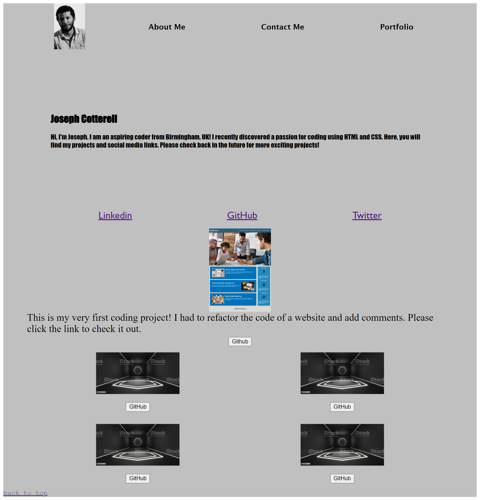

# Personal Portfolio

- Name: Joseph Cotterell
- Email: josephcotterell@hotmail.co.uk

# Description

-I have added a navigation bar with clickable links

-There are three sections: About Me, Contact Me and Portfolio

-I have added a profile picture of myself

-All links to github and my project are working

-I used CSS in Visual Studio Code to make this project. I pushed this project using GitBash.

## Screenshots

## 

## Link to GitHub repository

[You can find my repository here](https://github.com/josephcotterell/personal-portfolio)

## Link to deployed application

[Access this app on the deployed link here](https://josephcotterell.github.io/personal-portfolio/)
